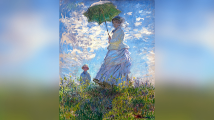
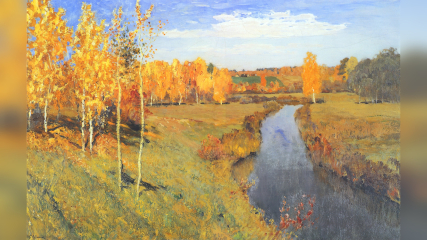
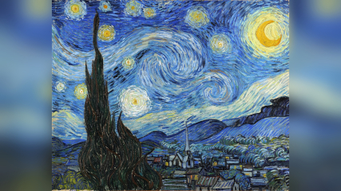
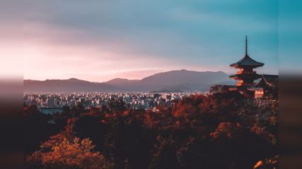
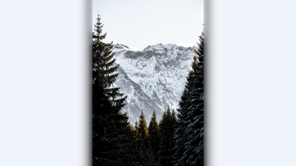
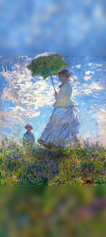
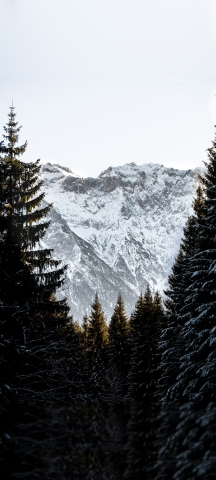

# Wallpaper art gallery UX

How to set user experience to enjoy the favourite art on the desktop. Examples of art to wallpaper conversion.

*[Autotranslated english version](https://github-com.translate.goog/kiwi0fruit/wallpaper-art-gallery-ux/blob/main/README.md?_x_tr_sl=ru&_x_tr_tl=en&_x_tr_hl=ru&_x_tr_pto=wapp)*.

Ниже представлена инструкция как организовать на рабочих столах ПК, и опционально смартфона, просмотр любимых картин и художественных фотографий. Сначала представлены примеры обоев из картин и художественных фотографий. После них дана инструкция.

## Примеры обоев из картин и фотографий

Если Вы знаете меня лично, то больше примеров с возможностью 
скачать есть в альбоме Wallpaper Art Gallery моего профиля VK.

  
[Download 1920x1080](./images/Claude_Monet_-_Woman_with_a_Parasol_-_Google_Art_Project__color_edited__1920x1080.jpg), [Download none-16:9 23MB image](./images/Claude_Monet_-_Woman_with_a_Parasol_-_Google_Art_Project__color_edited__23MB.jpg).

----

  
[Download 1920x1080](./images/Isaac_Levitan_-_Golden_Autumn__color_edited__1920x1080.jpg), [Download 16:9](./images/Isaac_Levitan_-_Golden_Autumn__color_edited__16x9.jpg).

----

  
[Download 1920x1080](./images/Van_Gogh_-_Starry_Night_-_Google_Art_Project__color_edited__1920x1080.jpg), [Download 16:9](./images/Van_Gogh_-_Starry_Night_-_Google_Art_Project__color_edited__16x9.jpg), [Download uncut image](./images/Van_Gogh_-_Starry_Night_-_Google_Art_Project__color_edited.jpg).

----

  
[Download 1920x1080](./images/Su_San_Lee_-_Kiyozumi_Dera_Kyoto_Japan__E_eWwM29wfU_Unsplash__1920x1080.jpg), [Download 16:9](./images/Su_San_Lee_-_Kiyozumi_Dera_Kyoto_Japan__E_eWwM29wfU_Unsplash__16x9.jpg).

----

  
[Download 1920x1080](./Paul_Fiedler_-_Garmisch-Partenkirchen_Germany__K81NdfnAdQI_Unsplash/1920x1080.jpg), [Download 16:9](./Paul_Fiedler_-_Garmisch-Partenkirchen_Germany__K81NdfnAdQI_Unsplash/16x9.jpg).

----

  
[Download 1080x2400](./images/Claude_Monet_-_Woman_with_a_Parasol_-_Google_Art_Project__color_edited__1080x2400.jpg), [Download 9x20](./images/Claude_Monet_-_Woman_with_a_Parasol_-_Google_Art_Project__color_edited__9x20.jpg), [Download none-9:20 23MB image](./images/Claude_Monet_-_Woman_with_a_Parasol_-_Google_Art_Project__color_edited__23MB.jpg).

----

  
[Download 1080x2400](./Paul_Fiedler_-_Garmisch-Partenkirchen_Germany__K81NdfnAdQI_Unsplash/1080x2400.jpg), [Download 9:20](./Paul_Fiedler_-_Garmisch-Partenkirchen_Germany__K81NdfnAdQI_Unsplash/9x20.jpg), [Download 1080x2400 with top black stripe (for slideshow)](./Paul_Fiedler_-_Garmisch-Partenkirchen_Germany__K81NdfnAdQI_Unsplash/1080x2400_slideshow.jpg).

## Инструкция

Для того, чтобы организовать на рабочих столах ПК, и опционально смартфона, просмотр любимых картин и художественных фотографий, нужно решить три задачи:

### Постановка задачи

1) Размеры почти всех картин и фотографий отличаются от формата рабочих столов ПК (16:9) и современных смартфонов (9:20). Попытки вырезать кусочек приводят к изменению композиции картины или фотографии, которые в случае эстетически удачных работ далеко не случайны. Это заметно ухудшает эстетику восприятия. Попытки добавить сбоку или снизу картину сплошным цветом для соответствия пропорциям по сути приводят к появлению по бокам очень плохой частичной рамки. А плохая рамка опять же ухудшает эстетическое восприятие работ.

2) Организовать удобный просмотр нескольких картин в режиме переключающегося слайдшоу так, чтобы их ничего не загораживало. Этот режим отлично подходит для ситуаций когда компьютер не используется. Тут все достаточно просто.

3) Организовать просмотр картин во время использования компьютера или смартфона. То есть, построить взаимодействие с устройствами так, чтобы во время использования неизбежно и желательно как можно 
чаще видеть картины так, чтобы их ничего не загораживало. А так же, чтобы не было конкурирующих обоев, которые будут хуже по эстетическому качеству, чем отобранные пользователями данной инструкции, ибо это тоже будет ухудшать эстетическое восприятие. В этом пункте уже посложнее, ибо по умолчанию часто картины будут с помехами на них, а обои других программ будут вторгаться без спросу.

### Предложенное решение

Решать данные задачи я буду на примере Windows 7 и Android. В будущем планирую добавить инструкцию для Ubuntu.

1\) Приемлемым с точки зрения эстетики решением проблемы несовпадения пропорций является расширение изображений размытыми и растянутыми частям этих же изображений, так,  чтобы они игнорировались периферийным зрением. Примеры этого подхода показаны выше в этой статье - можно скачать. Если же Вы знаете меня лично, то больше примеров с возможностью 
скачать есть в альбоме Wallpaper Art Gallery моего профиля VK. Я не придумал как автоматизировать такое расширение. В случае каждой работы требуются простые, но интуитивные подгонки, чтобы сделать так, чтобы добавленное не дисгармонировало. Всё операции можно легко и быстро провести в Paint.NET или сравнимом по функциям редакторе: расширение полотна до нужного соотношения сторон с пересчётом через пропорции 16:9 или 9:20; вставка и растяжение размытой версии картины в отдельном нижнем слое.

2\) Режим слайдшоу когда компьютер не используется легко организуется на любой операционной системе с помощью настройки заставки. Но я предпочитаю не плодить лишние сущности и использовать для этих целей рабочий стол, очищенный от помех. Этот же рабочий стол будет демонстрировать картины нам в задаче 3) при использовании компьютера. То есть, к следующей задаче мы подходим с требованием того, чтобы на рабочем столе было слайдшоу изображений, меняющееся автоматически по таймеру. Этот подход без лишних сущностей идеален, когда не нужно блокировать компьютер из соображений приватности или безопасности. Если же это нужно делать, то выбора нет, и придётся использовать и слайдшоу заставки, и слайдшоу рабочего стола.

3.1) Смена обоев рабочего стола по таймеру встроена в Windows 7, её можно установить в Ubuntu с помощью стороннего приложения Shotwell или же расширения Gnome [Wallpaper Changer](https://extensions.gnome.org/extension/1225/wallpaper-changer/). На Android из коробки можно установить смену обоев экрана блокировки. Для смены обоев рабочего стола придётся установить стороннее приложение типа [Wallpaper Changer](https://play.google.com/store/apps/details?id=de.j4velin.wallpaperChanger). Если использовать независимую смену в Android и тут, и там, то это будет раздражать (по крайней мере у меня так). Так что я остановился на синхронной смене и тут, и там (приложение это позволяет). Но есть нюанс: значки верхней панели не будут менять цвет при смене обоев - всегда как для первого в цепочке. Так что если начать с тёмного верха, то текст будет белым, и при переходе на белые обои его будет плохо видно (это чинится добавлением полоски правильного цвета сверху так, чтобы оставалось гарморично).

3.2) Для того, чтобы как надо наслаждаться картинами на рабочем столе его нужно очистить от помех. Первым делом в Windows 7 и монитре 16x9 это означает перенос панели пуск влево (вместо снизу) ибо полоска внизу занимает ценное место внизу, на котором лучше показать картину. А вот слева обычно у нас всегда не сама картина, а добавленная размытая область - от неё не жалко на панель место забрать. Панель очень желательно должна быть частично прозрачной (по умолчанию в Windows 7 она такая). В Ubuntu перенести все панели влево можно с помощью расширения Gnome [Dash to Panel](https://extensions.gnome.org/extension/1160/dash-to-panel/). Её можно сделать и прозрачной. При её использовании лучше поправить формат времени и даты с помощью расширения Gnome [Panel Date Format](https://extensions.gnome.org/extension/1462/panel-date-format/).

3.3) Так же, рабочий стол нужно очистить от ярлыков, чтобы они не создавали помехи просмотру картин. В Windows 7 это лучше всего сделать с помощью приложения под названием [AutoHideDesktopIcons](https://download.cnet.com/AutoHideDesktopIcons/3000-2072_4-75452184.html). Его нужно установить и добавить в автозапуск. И тут нужно убедиться, что Вы скачиваете именно [вот такой вот файл](https://www.virustotal.com/gui/file/9949f33a70e3d56613b30030c05c85dab1a8f4b0918d8cbbb25bbe3c6e9c27cf/details). В Ubuntu же есть расширение Gnome <to-be-added>, которое прячет ярлыки, но не автоматически, а вручную, что неудобно для пункта 3.4). Этого же эффекта можно добиться специальной командой в Bash, но в современных версиях Ubuntu проще воспользоваться расширением. В Android я не придумал ничего лучше, чем просто убрать обычные ярлыки с рабочего стола и оставить всего один пустой рабочий стол. Если же иметь второй рабочий стол и что-то с него запустить, то в будущем мы останемся на втором рабочем столе с ярлыками - что испортит восприятие изображения в будущем. Группировка и увеличение количества значков в меню приложений позволит делать почти всё, что нужно. А остальное можно запихать в панель избранного на рабочем столе в самом низу - я не убрал её. Что-то типа погоды можно перенести вообще в панель уведомлений.

3.4) Нужно избавиться от всех альтернативных обоев, кроме поставленных специально нами. В Android по умолчанию было такое, что обои рабочего стола не меняются, а только обои экрана блокировки меняются - это создаст дисгармонию когда обои не из одобренного набора картин, или же будет слегка раздражать неоптимальностью в случае когда когда неизменные обои выбраны из одобренного набора (ведь ситуация могла быть лучше - они могли бы меняться). Так же нужно отключить заставки-обои из новых вкладок браузера, например, в Brave. Ибо над ними у нас нет нормального контроля.

3.5) Но эти же обои из новых вкладок браузера дают нам подсказку о том, где бы мы вообще могли видеть картины во время работы (ибо рабочий стол мы таки видим редко). А нужно нам изменить привычки работы с интернетом так, чтобы видеть не новую вкладку браузера Brave, а рабочий стол. То есть, нужно перенести наиболее часто используемые закладки браузера на рабочий стол в операционной системе (браузеры на основе Chrome это точно позволяют). И когда они нужны, то сворачивать все окна и лицезреть пустой рабочий стол (как мы помним, в Windows значки были скрыты автоматически), кликать на него, от этого появятся ярлыки закладок интернет-ссылок, и переходить по ним. В Андроид все аналогично. Так же нам нужно как-то запускать поиск в интернете через рабочий стол. В Windows 7 это можно сделать с помощью установки [Cerebro](https://cerebroapp.com/), который добавляет многофункциональную строку поиска, которая вызывается горячими клавишами. После этого можно будет поменять hotkey в настройках Cerebro (на `Ctrl+Alt+d`)
и создать небольшой скрипт, который эмулирует нажатие hotkey, как описано [тут](https://stackoverflow.com/a/22838165) (и в скрипте нужно сменить `^%1` на `^%d`). Можно даже установить [вот эту папку](./cerebro) в место, защищенную от записи, и создать ярлык на рабочем столе к bat скрипту. Тогда при запуске этого ярлыка на рабочем столе у нас будет появляться строка поиска. Если вам не нравится Google поиск, то можно поменять на [cerebro-duck-duck-go](https://github.com/cerebroapp/cerebro-duck-duck-go). В Андроид все так же, только проще - достаточно поместить виджет строки поиска вверху рабочего стола (вверху опять же обычно будет расширенная размытая часть картины).
Если совсем озаботиться, то можно поместить ярлык запуска окна поиска прямо на панель избранного (например, [Simple Search](https://f-droid.org/en/packages/de.tobiasbielefeld.searchbar/)). Цвет значков на панели избранного можно изменить установкой набора значков
типа [этого](http://apps.samsung.com/theme/ProductDetail.as?appId=com.themeplicity.purplewinter.appiconpack)
или изменением значков с помощью [Shortcut Maker](https://play.google.com/store/apps/details?id=rk.android.app.shortcutmaker) ([вот этот значок](./images/search.png) может быть полезен - создавать ярлык нужно в режиме виджета).
Я пока не знаю как в Ubuntu организовать запуск поиска с рабочего стола и одновременно пустой рабочий стол.

**И да, организация пользовательского опыта как в 3.5) будет слегка менее оптимальной, нежели привычная. Но красота требует жертв и лично я готов их принести.**
